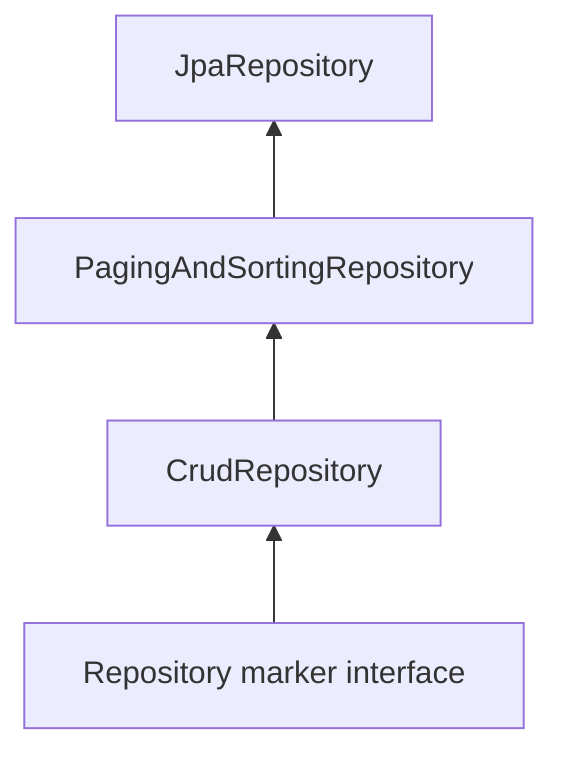

# Module 2: Spring Data JPA

## Topics Covered
- Repositories
- CRUD Repository
- JPA Repository

---

## 1. Repositories

Spring Data JPA implements the **Repository pattern**, generating data access implementations automatically at runtime from interface declarations — no manual DAO implementation required.

```java
public interface EmployeeRepository extends JpaRepository<Employee, Long> {
}
```

Spring Data generates a proxy implementation of `EmployeeRepository` at application startup, backed by Hibernate/JPA, and registers it as a Spring bean automatically (thanks to `@EnableJpaRepositories`, auto-configured by Spring Boot).

```java
@Service
public class EmployeeService {

    private final EmployeeRepository employeeRepository;

    public EmployeeService(EmployeeRepository employeeRepository) {
        this.employeeRepository = employeeRepository;
    }

    public Employee create(Employee employee) {
        return employeeRepository.save(employee);
    }
}
```

## 2. `CrudRepository`

`CrudRepository<T, ID>` is the base Spring Data interface providing generic CRUD operations.

```java
public interface EmployeeRepository extends CrudRepository<Employee, Long> {
}
```

Key methods:

| Method | Description |
|---|---|
| `save(entity)` | Insert or update an entity |
| `saveAll(entities)` | Batch save |
| `findById(id)` | Returns `Optional<T>` |
| `existsById(id)` | Checks existence |
| `findAll()` | Returns all entities |
| `count()` | Total entity count |
| `deleteById(id)` | Delete by primary key |
| `delete(entity)` | Delete a given entity |
| `deleteAll()` | Delete all entities |

```java
Employee saved = employeeRepository.save(new Employee(null, "Jane Doe", "jane@example.com"));
Optional<Employee> found = employeeRepository.findById(1L);
employeeRepository.deleteById(1L);
```

## 3. `JpaRepository`

`JpaRepository<T, ID>` extends `PagingAndSortingRepository` (which extends `CrudRepository`), adding JPA-specific and batch-oriented operations — this is the interface used in almost all Spring Boot applications.

```java
public interface EmployeeRepository extends JpaRepository<Employee, Long> {
}
```

Additional capabilities over `CrudRepository`:

```java
// Pagination and sorting
Page<Employee> page = employeeRepository.findAll(PageRequest.of(0, 10, Sort.by("name")));

// Batch flushing
employeeRepository.saveAllAndFlush(employees);

// Fetch all by IDs efficiently
List<Employee> employees = employeeRepository.findAllById(List.of(1L, 2L, 3L));

// Force synchronization with the database
employeeRepository.flush();
```

### Repository Hierarchy



| Interface | Adds |
|---|---|
| `Repository<T, ID>` | Marker interface, no methods |
| `CrudRepository<T, ID>` | Basic CRUD operations |
| `PagingAndSortingRepository<T, ID>` | `findAll(Pageable)`, `findAll(Sort)` |
| `JpaRepository<T, ID>` | Batch operations, `flush()`, JPA-specific query methods |

**Recommendation**: extend `JpaRepository` by default in Spring Boot + JPA applications, since it offers the fullest feature set with no extra cost.

---

## Key Takeaways
- Spring Data JPA generates repository implementations from interfaces at runtime — no boilerplate DAO code needed.
- `CrudRepository` provides basic CRUD; `JpaRepository` extends it with pagination, sorting, and batch operations.
- Always inject repositories through the service layer rather than accessing them directly from controllers, to keep business logic centralized.
