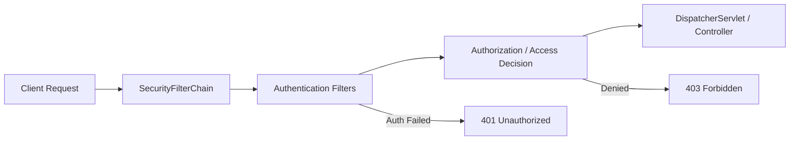

# Module 1: Spring Security

## Topics Covered
- Security architecture
- Authentication
- Authorization
- Role-Based Access Control (RBAC)

---

## 1. Security Architecture

Spring Security secures applications through a chain of **servlet filters** that intercept every incoming HTTP request before it reaches the application's controllers.



Core building blocks:

| Component | Responsibility |
|---|---|
| `SecurityFilterChain` | Ordered chain of filters applied to matching requests |
| `AuthenticationManager` | Coordinates authentication attempts |
| `AuthenticationProvider` | Validates credentials against a specific mechanism (DB, LDAP, JWT) |
| `UserDetailsService` | Loads user-specific data (username, password, authorities) |
| `SecurityContext` / `SecurityContextHolder` | Holds the currently authenticated principal for the request/thread |
| `AccessDecisionManager` / `AuthorizationManager` | Decides whether an authenticated principal can access a resource |

Minimal configuration (Spring Security 6+ / Spring Boot 3+ style):

```java
@Configuration
@EnableWebSecurity
public class SecurityConfig {

    @Bean
    public SecurityFilterChain filterChain(HttpSecurity http) throws Exception {
        http
            .authorizeHttpRequests(auth -> auth
                .requestMatchers("/api/public/**").permitAll()
                .anyRequest().authenticated())
            .httpBasic(Customizer.withDefaults())
            .csrf(csrf -> csrf.disable()); // disable only for stateless REST APIs using tokens
        return http.build();
    }

    @Bean
    public PasswordEncoder passwordEncoder() {
        return new BCryptPasswordEncoder();
    }
}
```

**Security note**: never disable CSRF protection for browser-based session/cookie-authenticated applications — it is only safe to disable for stateless, token-based (JWT) REST APIs that don't rely on cookies for authentication.

## 2. Authentication

Authentication verifies **who the user is** (identity), typically via username/password, tokens, or external identity providers.

```java
@Service
public class CustomUserDetailsService implements UserDetailsService {

    private final UserRepository userRepository;

    public CustomUserDetailsService(UserRepository userRepository) {
        this.userRepository = userRepository;
    }

    @Override
    public UserDetails loadUserByUsername(String username) {
        User user = userRepository.findByUsername(username)
                .orElseThrow(() -> new UsernameNotFoundException("User not found: " + username));

        return org.springframework.security.core.userdetails.User
                .withUsername(user.getUsername())
                .password(user.getPasswordHash())
                .authorities(user.getRoles().toArray(new String[0]))
                .build();
    }
}
```

**Security note**: always store passwords hashed with a strong, adaptive algorithm (`BCryptPasswordEncoder`) — never store or compare plaintext passwords.

## 3. Authorization

Authorization determines **what an authenticated user is allowed to do**, based on granted authorities/roles.

```java
@Bean
public SecurityFilterChain filterChain(HttpSecurity http) throws Exception {
    http.authorizeHttpRequests(auth -> auth
        .requestMatchers("/api/admin/**").hasRole("ADMIN")
        .requestMatchers(HttpMethod.GET, "/api/employees/**").hasAnyRole("ADMIN", "MANAGER", "USER")
        .requestMatchers(HttpMethod.POST, "/api/employees/**").hasAnyRole("ADMIN", "MANAGER")
        .anyRequest().authenticated());
    return http.build();
}
```

Method-level authorization with `@PreAuthorize`:

```java
@Service
public class EmployeeService {

    @PreAuthorize("hasRole('ADMIN')")
    public void deleteEmployee(Long id) {
        // only admins reach this point
    }

    @PreAuthorize("hasRole('MANAGER') and #employeeId == authentication.principal.managedEmployeeId")
    public Employee getEmployee(Long employeeId) {
        // fine-grained rule combining role and ownership
        return null;
    }
}
```

Enable method security:

```java
@Configuration
@EnableMethodSecurity
public class MethodSecurityConfig {
}
```

## 4. Role-Based Access Control (RBAC)

RBAC assigns **roles** to users, and permissions are granted based on those roles rather than to individual users directly.

```java
@Entity
public class User {

    @Id
    @GeneratedValue(strategy = GenerationType.IDENTITY)
    private Long id;

    private String username;
    private String passwordHash;

    @ElementCollection(fetch = FetchType.EAGER)
    private Set<String> roles = new HashSet<>(); // e.g., "ROLE_ADMIN", "ROLE_USER"
}
```

| Concept | Example |
|---|---|
| Role | `ROLE_ADMIN`, `ROLE_MANAGER`, `ROLE_USER` |
| Permission/Authority | `EMPLOYEE_READ`, `EMPLOYEE_WRITE`, `EMPLOYEE_DELETE` |
| Role-to-permission mapping | `ROLE_ADMIN` → all permissions; `ROLE_USER` → `EMPLOYEE_READ` only |

Design guideline: model coarse-grained access with **roles** (`hasRole`) and fine-grained access with **authorities/permissions** (`hasAuthority`) when roles alone aren't expressive enough — e.g., `ROLE_MANAGER` plus a specific `EMPLOYEE_APPROVE` authority.

---

## Key Takeaways
- Spring Security enforces security through a configurable chain of servlet filters (`SecurityFilterChain`).
- Authentication establishes identity; authorization decides what an authenticated identity can do.
- Always hash passwords with `BCryptPasswordEncoder` and disable CSRF only for stateless token-based APIs.
- RBAC (`hasRole`/`hasAnyRole`) combined with method-level `@PreAuthorize` provides layered, fine-grained access control.
