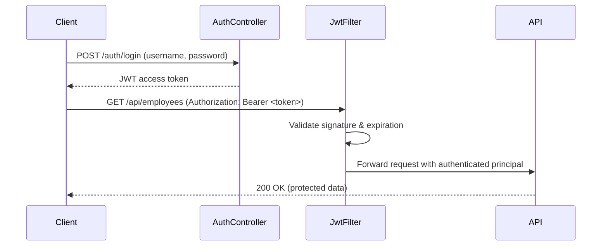

# Module 2: JWT Authentication

## Topics Covered
- Introduction to JWT
- Securing REST APIs
- Token generation and validation

---

## 1. Introduction to JWT

JSON Web Token (JWT) is a compact, self-contained, URL-safe token format used to represent claims (user identity, roles, expiration) securely between two parties. It's the standard approach for stateless authentication in REST APIs and microservices.

A JWT has three Base64URL-encoded parts separated by dots: `header.payload.signature`

```
eyJhbGciOiJIUzI1NiJ9.eyJzdWIiOiJqYW5lIiwicm9sZXMiOlsiVVNFUiJdLCJleHAiOjE3MjY3NzYwMDB9.4f8c...
```

- **Header** — algorithm and token type (e.g., `{"alg":"HS256","typ":"JWT"}`).
- **Payload (claims)** — data such as `sub` (subject/username), `roles`, `iat` (issued at), `exp` (expiration).
- **Signature** — cryptographic signature (HMAC or RSA) verifying the token hasn't been tampered with.

**Why JWT for REST APIs**: it enables **stateless** authentication — the server doesn't need to store session state; each request carries its own proof of identity, which scales naturally across multiple service instances.

## 2. Securing REST APIs

Typical JWT authentication flow:



Configure a stateless security filter chain:

```java
@Configuration
@EnableWebSecurity
public class SecurityConfig {

    private final JwtAuthFilter jwtAuthFilter;

    public SecurityConfig(JwtAuthFilter jwtAuthFilter) {
        this.jwtAuthFilter = jwtAuthFilter;
    }

    @Bean
    public SecurityFilterChain filterChain(HttpSecurity http) throws Exception {
        http
            .csrf(csrf -> csrf.disable())
            .sessionManagement(session -> session.sessionCreationPolicy(SessionCreationPolicy.STATELESS))
            .authorizeHttpRequests(auth -> auth
                .requestMatchers("/auth/**").permitAll()
                .anyRequest().authenticated())
            .addFilterBefore(jwtAuthFilter, UsernamePasswordAuthenticationFilter.class);
        return http.build();
    }
}
```

`SessionCreationPolicy.STATELESS` ensures Spring Security never creates or uses an HTTP session — every request must carry a valid JWT.

## 3. Token Generation and Validation

### Generating a Token

```java
@Component
public class JwtService {

    @Value("${jwt.secret}")
    private String secret; // load from environment/secret manager, never hardcode

    @Value("${jwt.expiration-ms}")
    private long expirationMs;

    public String generateToken(UserDetails userDetails) {
        SecretKey key = Keys.hmacShaKeyFor(secret.getBytes(StandardCharsets.UTF_8));

        return Jwts.builder()
                .subject(userDetails.getUsername())
                .claim("roles", userDetails.getAuthorities().stream()
                        .map(GrantedAuthority::getAuthority).toList())
                .issuedAt(new Date())
                .expiration(new Date(System.currentTimeMillis() + expirationMs))
                .signWith(key)
                .compact();
    }

    public String extractUsername(String token) {
        return parseClaims(token).getSubject();
    }

    public boolean isTokenValid(String token, UserDetails userDetails) {
        String username = extractUsername(token);
        return username.equals(userDetails.getUsername()) && !isExpired(token);
    }

    private boolean isExpired(String token) {
        return parseClaims(token).getExpiration().before(new Date());
    }

    private Claims parseClaims(String token) {
        SecretKey key = Keys.hmacShaKeyFor(secret.getBytes(StandardCharsets.UTF_8));
        return Jwts.parser().verifyWith(key).build()
                .parseSignedClaims(token).getPayload();
    }
}
```

### Login Endpoint

```java
@RestController
@RequestMapping("/auth")
public class AuthController {

    private final AuthenticationManager authenticationManager;
    private final JwtService jwtService;
    private final UserDetailsService userDetailsService;

    // constructor omitted for brevity

    @PostMapping("/login")
    public ResponseEntity<AuthResponse> login(@RequestBody LoginRequest request) {
        authenticationManager.authenticate(
                new UsernamePasswordAuthenticationToken(request.username(), request.password()));

        UserDetails userDetails = userDetailsService.loadUserByUsername(request.username());
        String token = jwtService.generateToken(userDetails);

        return ResponseEntity.ok(new AuthResponse(token));
    }
}

public record LoginRequest(String username, String password) { }
public record AuthResponse(String token) { }
```

### Validating Tokens on Each Request

```java
@Component
public class JwtAuthFilter extends OncePerRequestFilter {

    private final JwtService jwtService;
    private final UserDetailsService userDetailsService;

    // constructor omitted for brevity

    @Override
    protected void doFilterInternal(HttpServletRequest request, HttpServletResponse response,
                                     FilterChain chain) throws ServletException, IOException {

        String header = request.getHeader("Authorization");
        if (header == null || !header.startsWith("Bearer ")) {
            chain.doFilter(request, response);
            return;
        }

        String token = header.substring(7);
        String username = jwtService.extractUsername(token);

        if (username != null && SecurityContextHolder.getContext().getAuthentication() == null) {
            UserDetails userDetails = userDetailsService.loadUserByUsername(username);

            if (jwtService.isTokenValid(token, userDetails)) {
                UsernamePasswordAuthenticationToken authToken =
                        new UsernamePasswordAuthenticationToken(userDetails, null, userDetails.getAuthorities());
                SecurityContextHolder.getContext().setAuthentication(authToken);
            }
        }

        chain.doFilter(request, response);
    }
}
```

**Security best practices**:
- Store the signing secret in a secrets manager or environment variable — never commit it to source control.
- Use short-lived access tokens (e.g., 15–60 minutes) paired with a longer-lived refresh token mechanism.
- Always validate both the signature **and** expiration before trusting any claim in the token.
- Serve APIs only over HTTPS — JWTs sent over plaintext HTTP can be intercepted.

---

## Key Takeaways
- JWT enables stateless authentication by embedding signed, verifiable claims directly in the token.
- A `JwtAuthFilter` validates the token on every request and populates the `SecurityContext` before the request reaches controllers.
- Keep signing secrets out of source control, use short-lived tokens, and always serve token-based APIs over HTTPS.
