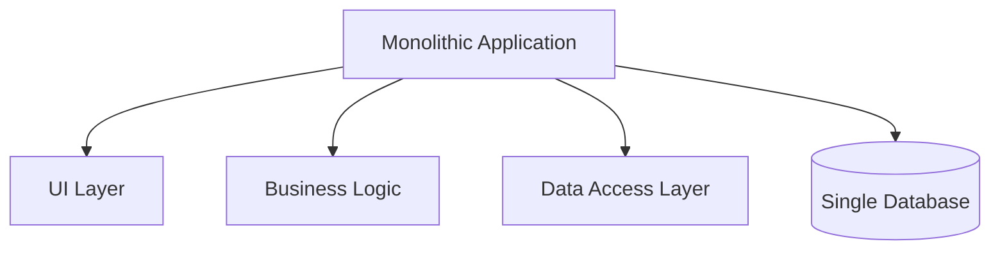
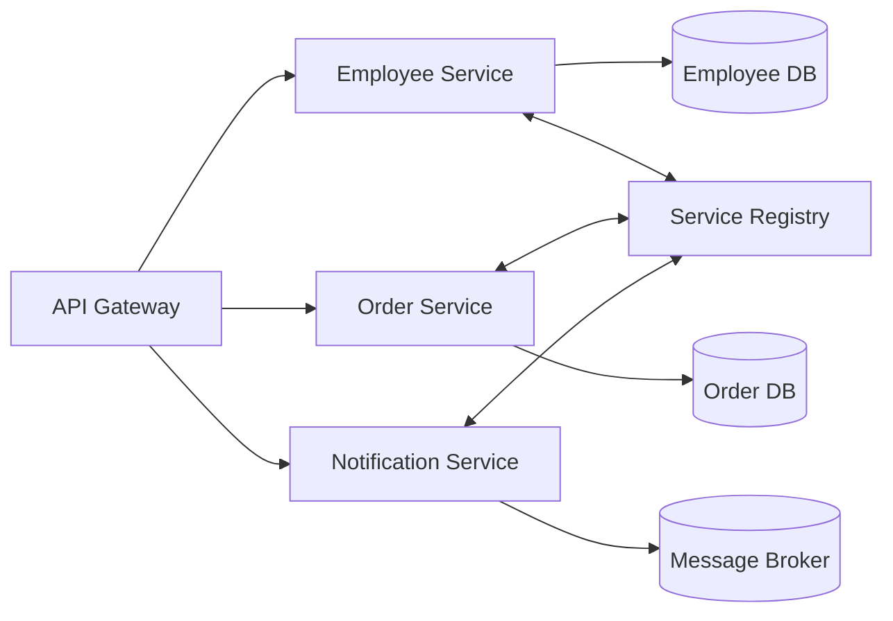

# Module 3: Introduction to Microservices

## Topics Covered
- Monolithic vs microservices architecture
- Benefits and challenges

---

## 1. Monolithic vs Microservices Architecture

### Monolithic Architecture

A single deployable unit containing all application functionality (UI, business logic, data access) in one codebase and one process.

### Microservices Architecture

The application is decomposed into small, independently deployable services, each owning a specific business capability and typically its own datastore.

### Comparison

| Aspect | Monolith | Microservices |
|---|---|---|
| Deployment | Single unit, deployed together | Independent services, deployed separately |
| Scaling | Scale the entire application | Scale individual services based on their load |
| Technology stack | Usually one stack for the whole app | Each service can use a different stack |
| Data ownership | Typically one shared database | Each service often owns its own database |
| Development team | One team (or tightly coordinated teams) on one codebase | Small, autonomous teams per service |
| Failure isolation | A bug can bring down the entire application | A failing service can be isolated (with proper resilience patterns) |
| Complexity | Simpler to develop/test/deploy initially | Higher operational complexity (network calls, distributed data) |

## 2. Benefits and Challenges

### Benefits of Microservices

- **Independent deployability** — teams ship changes to one service without redeploying the entire system.
- **Technology flexibility** — each service can choose the best-fit language/framework/database.
- **Scalability** — scale only the services under load (e.g., scale `Order Service` during a sale, not the whole system).
- **Fault isolation** — a failure in one service doesn't necessarily crash the whole application (with circuit breakers/timeouts).
- **Team autonomy** — smaller, focused codebases map to smaller, autonomous teams (aligns with Conway's Law).

### Challenges of Microservices

- **Distributed system complexity** — network latency, partial failures, and message ordering must be handled explicitly.
- **Data consistency** — no single shared database/transaction; often requires eventual consistency and patterns like Saga.
- **Service discovery & configuration** — services need a way to find each other and share configuration dynamically.
- **Operational overhead** — more moving parts to deploy, monitor, log, and trace (requires strong DevOps/observability practices).
- **Testing complexity** — integration and end-to-end testing span multiple services and their interactions.
- **Increased latency** — inter-service calls over the network are slower than in-process method calls within a monolith.

### When to Choose Which

| Choose Monolith When | Choose Microservices When |
|---|---|
| Small team, early-stage product | Large organization with multiple autonomous teams |
| Simple domain, low scaling needs | Different components have very different scaling/technology needs |
| Fast time-to-market is critical | Long-term investment justifies the operational overhead |
| Limited DevOps/infrastructure maturity | Mature CI/CD, monitoring, and container orchestration in place |

**Guideline**: many successful systems start as a well-structured monolith ("modular monolith") and extract services only when clear scaling or team-boundary needs emerge — microservices are a solution to organizational/scaling problems, not a default starting point.

---

## Key Takeaways
- Monoliths bundle everything into one deployable unit; microservices decompose the system into independently deployable services.
- Microservices trade simplicity for independent scalability, technology flexibility, and team autonomy.
- The main costs are distributed system complexity, data consistency challenges, and higher operational overhead.
- Choose the architecture based on team size, domain complexity, and organizational maturity — not as a default choice.
