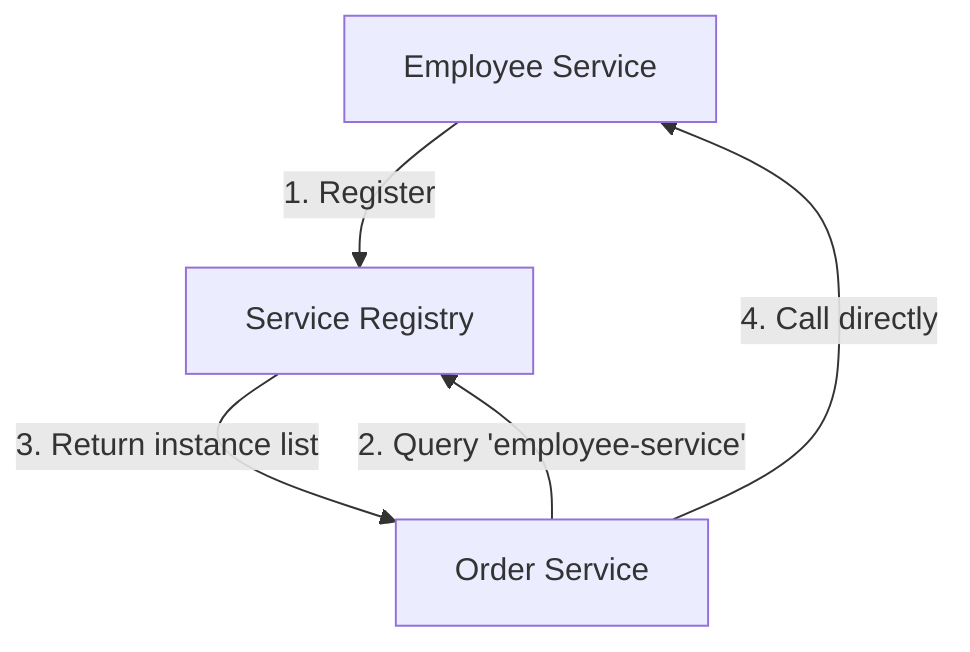
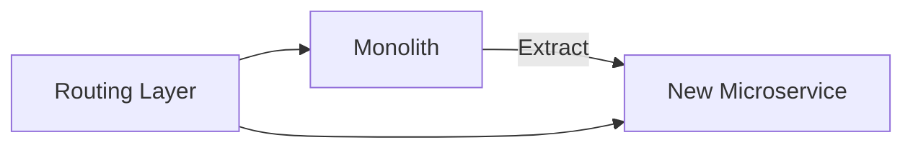

# Module 4: Spring Cloud Fundamentals

## Topics Covered
- Service discovery
- Eureka Server and Client
- API Gateway
- Configuration management
- Microservices Deployment Patterns

---

## 1. Service Discovery

In a microservices architecture, service instances are dynamic (scaled up/down, restarted with new IPs). **Service discovery** lets services find each other by logical name instead of hardcoded host/port.



- **Client-side discovery**: the calling service queries the registry and load-balances requests itself (Spring Cloud's typical approach with Eureka + `RestClient`/`WebClient` + load balancer).
- **Server-side discovery**: a load balancer/gateway queries the registry on the client's behalf (common with Kubernetes Services).

## 2. Eureka Server and Client

Netflix Eureka is the most widely used service registry in the Spring Cloud ecosystem.

### Eureka Server

```xml
<dependency>
    <groupId>org.springframework.cloud</groupId>
    <artifactId>spring-cloud-starter-netflix-eureka-server</artifactId>
</dependency>
```

```java
@SpringBootApplication
@EnableEurekaServer
public class DiscoveryServerApplication {
    public static void main(String[] args) {
        SpringApplication.run(DiscoveryServerApplication.class, args);
    }
}
```

```properties
# application.properties (Eureka Server)
server.port=8761
eureka.client.register-with-eureka=false
eureka.client.fetch-registry=false
```

### Eureka Client

```xml
<dependency>
    <groupId>org.springframework.cloud</groupId>
    <artifactId>spring-cloud-starter-netflix-eureka-client</artifactId>
</dependency>
```

```properties
# application.properties (Employee Service)
spring.application.name=employee-service
eureka.client.service-url.defaultZone=http://localhost:8761/eureka/
```

Calling another service by logical name using a load-balanced client:

```java
@Configuration
public class RestClientConfig {

    @Bean
    @LoadBalanced
    public RestClient.Builder restClientBuilder() {
        return RestClient.builder();
    }
}

@Service
public class OrderService {

    private final RestClient restClient;

    public OrderService(RestClient.Builder restClientBuilder) {
        this.restClient = restClientBuilder.build();
    }

    public Employee getEmployee(Long id) {
        return restClient.get()
                .uri("http://employee-service/api/employees/{id}", id)
                .retrieve()
                .body(Employee.class);
    }
}
```

## 3. API Gateway

An API Gateway is the single entry point for external clients, responsible for routing, cross-cutting concerns (auth, rate limiting), and hiding internal service topology.

```xml
<dependency>
    <groupId>org.springframework.cloud</groupId>
    <artifactId>spring-cloud-starter-gateway</artifactId>
</dependency>
```

```yaml
# application.yml (Gateway)
spring:
  cloud:
    gateway:
      routes:
        - id: employee-service
          uri: lb://employee-service
          predicates:
            - Path=/api/employees/**
        - id: order-service
          uri: lb://order-service
          predicates:
            - Path=/api/orders/**
          filters:
            - StripPrefix=0
```

Benefits: centralized authentication/authorization, rate limiting, request logging, and a single hostname for all clients — internal service boundaries and scaling remain invisible to consumers.

## 4. Configuration Management

Spring Cloud Config centralizes externalized configuration across all services, backed by a Git repository (or other backend).

```xml
<dependency>
    <groupId>org.springframework.cloud</groupId>
    <artifactId>spring-cloud-config-server</artifactId>
</dependency>
```

```java
@SpringBootApplication
@EnableConfigServer
public class ConfigServerApplication {
    public static void main(String[] args) {
        SpringApplication.run(ConfigServerApplication.class, args);
    }
}
```

```properties
# Config Server
spring.cloud.config.server.git.uri=https://github.com/example/config-repo
server.port=8888
```

Client-side (each microservice):

```properties
# bootstrap.properties / application.properties
spring.application.name=employee-service
spring.config.import=optional:configserver:http://localhost:8888
```

Benefits: centralized, versioned configuration; environment-specific overrides (`employee-service-prod.properties`); dynamic refresh via `/actuator/refresh` without redeploying.

## 5. Microservices Deployment Patterns

| Pattern | Description |
|---|---|
| **Single Service per Host/Container** | Each service instance runs in its own container (most common with Docker/Kubernetes) |
| **Sidecar Pattern** | A helper container (e.g., service mesh proxy, log shipper) runs alongside the main service container |
| **Service Mesh** | Infrastructure layer (e.g., Istio, Linkerd) handles service-to-service communication, retries, and observability transparently |
| **Blue-Green Deployment** | Two identical environments (blue/green); traffic switches entirely from old to new version |
| **Canary Deployment** | New version receives a small percentage of traffic before a full rollout |
| **Strangler Fig Pattern** | Gradually replace parts of a monolith with microservices, routing traffic incrementally to the new services |



Containerization (Docker) and orchestration (Kubernetes) are the de facto standard for deploying microservices at scale, providing scaling, self-healing, and rolling updates out of the box.

---

## Key Takeaways
- Service discovery (Eureka) lets services find each other dynamically instead of relying on hardcoded addresses.
- An API Gateway (Spring Cloud Gateway) centralizes routing and cross-cutting concerns for external clients.
- Spring Cloud Config centralizes and versions configuration across all microservices.
- Deployment patterns (canary, blue-green, strangler fig) reduce risk when rolling out changes to distributed systems.
