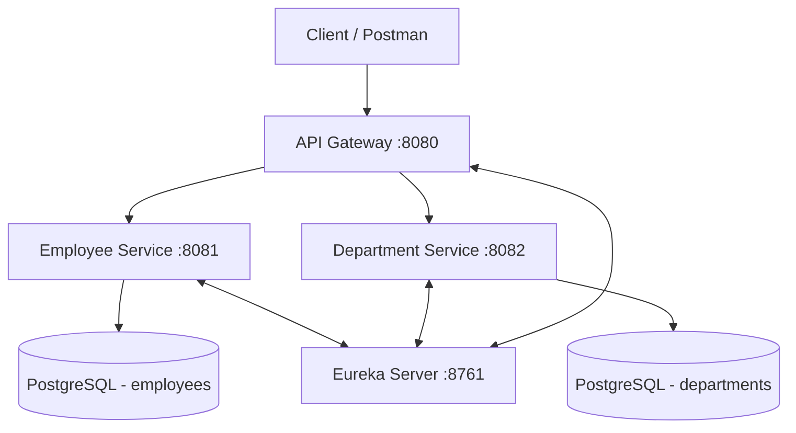

# Module 5: Capstone Project

## Topics Covered
- Build end-to-end Spring Boot application
- REST APIs
- Database integration
- Security implementation
- Microservice communication demo

---

## Overview

The capstone project consolidates everything from Days 1–5 into a single, cohesive system: an **Employee Management Platform** composed of two collaborating microservices behind an API Gateway, secured with JWT, and backed by PostgreSQL.



## Step 1: Build End-to-End Spring Boot Application

Project layout (multi-module or separate repositories):

```
capstone/
├── discovery-server/     (Eureka Server, Day 5 Module 4)
├── api-gateway/          (Spring Cloud Gateway, Day 5 Module 4)
├── department-service/   (Spring Boot + JPA, Day 4)
└── employee-service/     (Spring Boot + JPA + Security, Days 3-5)
```

Each service is independently runnable, using the patterns from earlier modules: `@SpringBootApplication`, layered `controller/service/repository` packages, and `application.properties` per service.

## Step 2: REST APIs

Reuse the Day 3 CRUD patterns for both services.

```java
// employee-service
@RestController
@RequestMapping("/api/employees")
public class EmployeeController {

    private final EmployeeService employeeService;

    public EmployeeController(EmployeeService employeeService) {
        this.employeeService = employeeService;
    }

    @PostMapping
    public ResponseEntity<Employee> create(@Valid @RequestBody EmployeeRequest request) {
        return ResponseEntity.status(HttpStatus.CREATED).body(employeeService.create(request));
    }

    @GetMapping("/{id}")
    public Employee getById(@PathVariable Long id) {
        return employeeService.findById(id);
    }
}
```

```java
// department-service
@RestController
@RequestMapping("/api/departments")
public class DepartmentController {

    private final DepartmentService departmentService;

    public DepartmentController(DepartmentService departmentService) {
        this.departmentService = departmentService;
    }

    @GetMapping("/{id}")
    public Department getById(@PathVariable Long id) {
        return departmentService.findById(id);
    }
}
```

Add global exception handling (`@RestControllerAdvice`) and Bean Validation (`@Valid`) in each service, as covered in Day 3.

## Step 3: Database Integration

Each service owns its own PostgreSQL schema (database-per-service pattern):

```properties
# employee-service/application.properties
spring.datasource.url=jdbc:postgresql://localhost:5432/employee_db
spring.jpa.hibernate.ddl-auto=validate
```

```properties
# department-service/application.properties
spring.datasource.url=jdbc:postgresql://localhost:5432/department_db
spring.jpa.hibernate.ddl-auto=validate
```

Use Flyway or Liquibase migrations for schema versioning in each service, and Spring Data JPA repositories/entities as in Day 4.

## Step 4: Security Implementation

Apply Day 5's JWT authentication to `employee-service` (and optionally `department-service`):

```java
@Configuration
@EnableWebSecurity
public class SecurityConfig {

    private final JwtAuthFilter jwtAuthFilter;

    @Bean
    public SecurityFilterChain filterChain(HttpSecurity http) throws Exception {
        http
            .csrf(csrf -> csrf.disable())
            .sessionManagement(s -> s.sessionCreationPolicy(SessionCreationPolicy.STATELESS))
            .authorizeHttpRequests(auth -> auth
                .requestMatchers("/auth/**").permitAll()
                .requestMatchers("/api/employees/**").hasAnyRole("ADMIN", "MANAGER")
                .anyRequest().authenticated())
            .addFilterBefore(jwtAuthFilter, UsernamePasswordAuthenticationFilter.class);
        return http.build();
    }
}
```

The API Gateway forwards the `Authorization: Bearer <token>` header transparently to downstream services; each service independently validates the token (stateless, no shared session).

## Step 5: Microservice Communication Demo

`employee-service` calls `department-service` to enrich employee data with department details, using Eureka for discovery:

```java
@Service
public class EmployeeEnrichmentService {

    private final RestClient restClient;

    public EmployeeEnrichmentService(@LoadBalanced RestClient.Builder builder) {
        this.restClient = builder.build();
    }

    public Department fetchDepartment(Long departmentId) {
        return restClient.get()
                .uri("http://department-service/api/departments/{id}", departmentId)
                .retrieve()
                .body(Department.class);
    }
}
```

### Demo Script

1. Start `discovery-server`, then `department-service`, `employee-service`, and `api-gateway`.
2. Confirm both services register with Eureka (`http://localhost:8761`).
3. `POST /auth/login` via the gateway to obtain a JWT.
4. `POST /api/employees` (with the JWT) via the gateway — creates an employee and enriches the response with department data fetched from `department-service`.
5. `GET /api/employees/{id}` — verify the combined employee + department payload.
6. Stop `department-service` and observe graceful error handling (e.g., a fallback or a clear 503 rather than a hang), demonstrating the need for resilience patterns (circuit breakers/timeouts) in distributed systems.

## Evaluation Checklist

- [ ] Both services register with and are discoverable via Eureka
- [ ] The API Gateway correctly routes requests to each service
- [ ] JWT authentication protects endpoints; unauthenticated requests are rejected
- [ ] CRUD operations persist correctly to each service's own PostgreSQL database
- [ ] `employee-service` successfully calls `department-service` and combines the data
- [ ] Validation and global exception handling return consistent error responses across services

---

## Key Takeaways
- The capstone project integrates REST APIs, JPA persistence, JWT security, and service discovery into one working system.
- Each microservice owns its own database, communicating over HTTP via service discovery rather than direct database access.
- The API Gateway is the single entry point, delegating authentication/authorization enforcement to a stateless JWT scheme shared across services.
